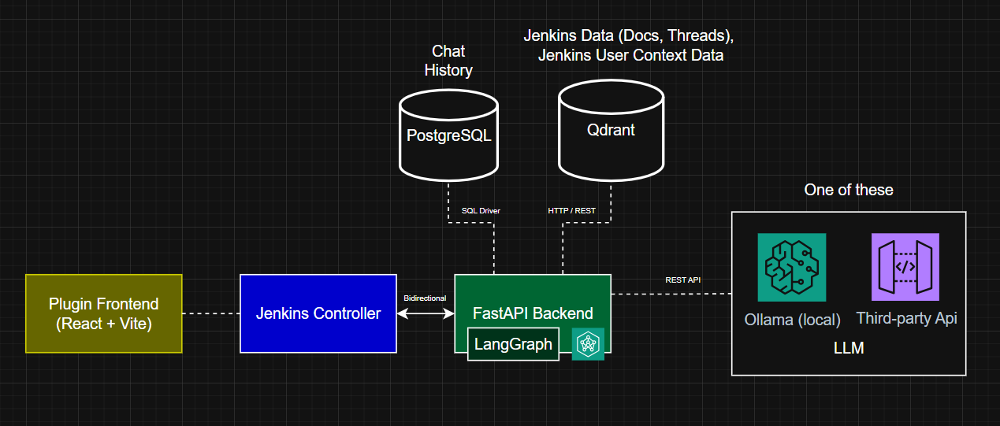

# API

In this section we are gonna explore how the Jenkins Controller and the FastAPI Backend 
communicate making the whole plugin work.

## Architecture Overview

In the following picture you can see the system architecture. 



### Frontend
From the Frontend UI there the user can navigate through chat history, upload the context and communicate with the agent. Every request is forwarded to the Controller.

### Jenkins Controller
As displayed the frontend and the backend never commmunicates directly, the whole plugin has been built to have the Jenkins Controller as the proxy of each request between the two.
Both the Jenkins Controller and the Fastapi Backend shares the same Secret key and secure each request with a JWT token.

### FastAPI Backend
The backend primarly just receives requests forwarded from then Jenkins Controller, but if the agent asks can send a request to the Jenkins Controller using the get_workspace_tree and get_workspace_file tools.

```{toctree}
:maxdepth: 1

backend
jenkins_controller
```

