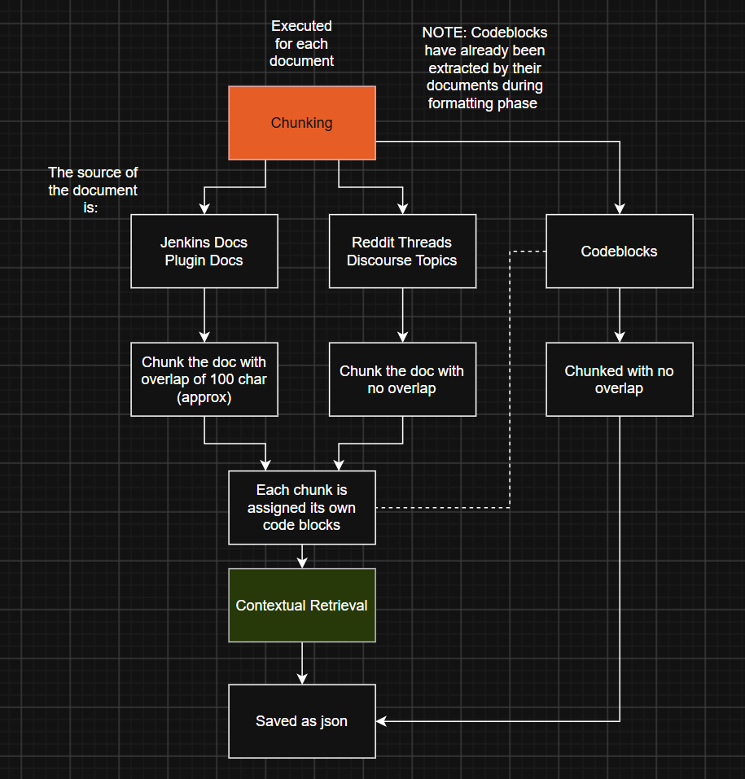
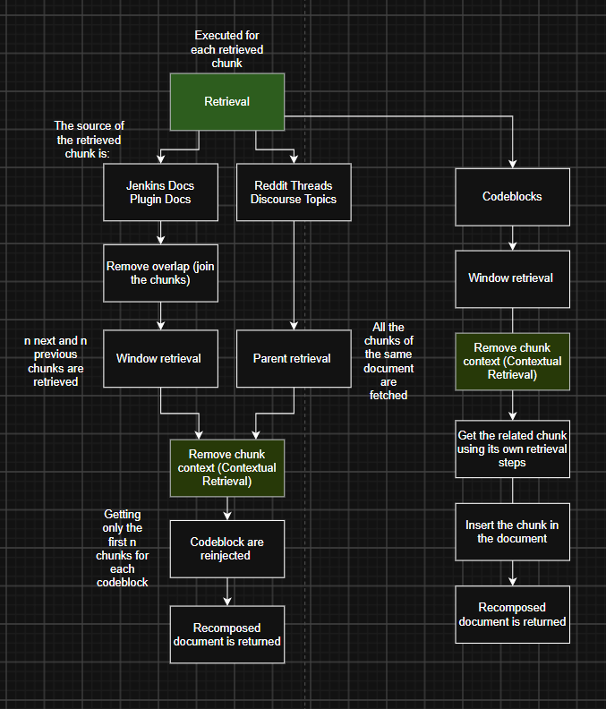
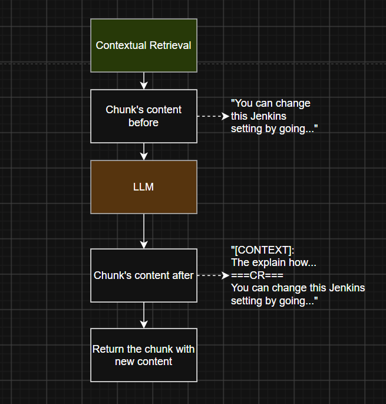

# Chunking

The chunking phase distinguishes only between original sources and code blocks. 
If contextual retrieval is enabled, it is applied to all chunks. 
In this phase, all code blocks are assigned to their specific chunk; after that, the code blocks themselves are also chunked. Naturally, one chunk can contain more than one code block, but a code block can be assigned to only one chunk. 

- **Input**: `output/documents/`
- **Output**: `output/chunks/`

**To run the chunking phase:**
```bash
python -m data.chunking.chunker
```

## Code Block Binding Functions

These functions handle the extraction and re-association of code blocks that were replaced with placeholders during the formatting phase.

*   **`assign_code_blocks_to_chunks`**: Scans the content of text chunks using a regex pattern to locate code block placeholders (e.g., `[[CODE_BLOCK_1]]`). It maps these matched indices to their corresponding code block documents and returns a list linking each chunk to its respective code blocks.
*   **`bind_chunks_to_code_blocks`**: Reads the available code block JSON files from the directory and uses `assign_code_blocks_to_chunks` to evaluate the associations. It then injects the code block IDs (`cb_ids`) into the chunk's metadata and adds the chunk's ID (`related_id`) into the code block's metadata, saving the updated code blocks back to the disk.

## Chunking and Retrieval Strategy

The chunking and retrieval strategy differs between sources: 

*   **`jenkins_docs`** and **`plugin_docs`** (Hybrid window retrieval): Chunked with an approximate overlap of 100 characters. During retrieval time, the overlap is removed and Window Retrieval is applied so that the *n* previous and *n* next chunks are fetched, giving the LLM clean text.
*   **`discourse_topics`** and **`reddit_threads`** (Parent-child retrieval): Chunked without overlap. At retrieval time, Parent-child Retrieval is applied. 
*   **`code_blocks`**: When a code block is retrieved from the vector database, the related chunk is retrieved using `related_id`. Then, the *n* previous and *n* next chunks of the code block are retrieved; the same happens for the related chunk. Finally, the reconstructed code block is injected into the reconstructed related document.  





## Document Processing and Chunking

These functions manage the core splitting logic and the overall orchestration of the document pipeline.

*   **`process_doc`**: Takes a single document and splits it into smaller text fragments using a `RecursiveCharacterTextSplitter`. It generates a deterministic UUID for each chunk (required for vector stores like Qdrant) and bundles it into a LangChain `Document` object with relevant tracking metadata.
*   **`process_doc_list`**: Orchestrates the processing of multiple documents while applying source-specific rules. It configures chunk overlap dynamically—using overlap for official documentation (Jenkins/Plugin docs) and zero overlap for hierarchical parent-child structures (Discourse/Reddit). It also triggers the code block binding step for applicable sources.

Finally, each chunk (including code blocks) has these 3 additional fields in its metadata:
```json
{
    // ...
    "chunk_index": 0,
    "total_chunks": 1,
    "parent_id": "CB_D_812_N_0"
}
```

## Contextual Retrieval

This module is responsible for enriching individual text chunks with broader document context to improve retrieval accuracy.

*   **`contextualize_chunk`**: Utilizes an LLM to generate a brief (1-3 sentences) contextual summary for a specific chunk based on its parent document. It supports Anthropic-specific prompt caching for efficiency and prepends the generated context to the chunk using a `===CR===` separator.
*   **`contextualize_chunk_list`**: Iterates through a provided list of chunk documents, reads the corresponding parent documents from the filesystem, and applies `contextualize_chunk` to update the content of each chunk in the list.


