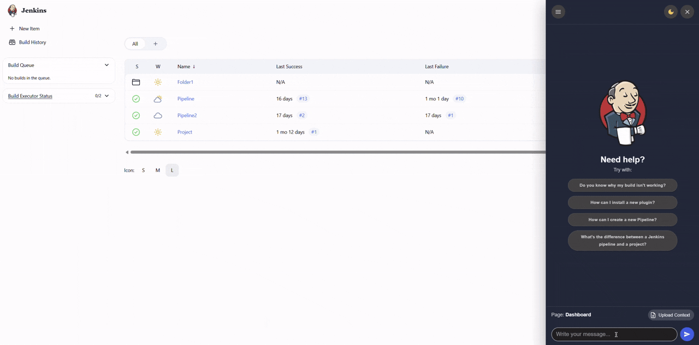

# Welcome in AI Chatbot to Guide User Workflow Plugin

This is the documentation for the AI ​​Chatbot to Guide User Workflow plugin, which integrates an agent-powered chatbot into the Jenkins interface.
This tool is useful for both beginners who need guidance within the software and experts who need to troubleshoot a specific build failed.

Question: Do you know why the build failed?


Question: How can I install a new plugin?



The documentation is divided into two parts:
- User Guide
- Developer Documentation


The user guides are intended for those who simply want to configure the plugin for an initial overview or those who want to deploy it in production, understanding all the different options and possible configurations.

The developer documentation is intended for developers who want to contribute to the plugin or simply understand its inner workings.

```{toctree}
:maxdepth: 2
:caption: Content:

user-guide/index
developer-docs/index
```